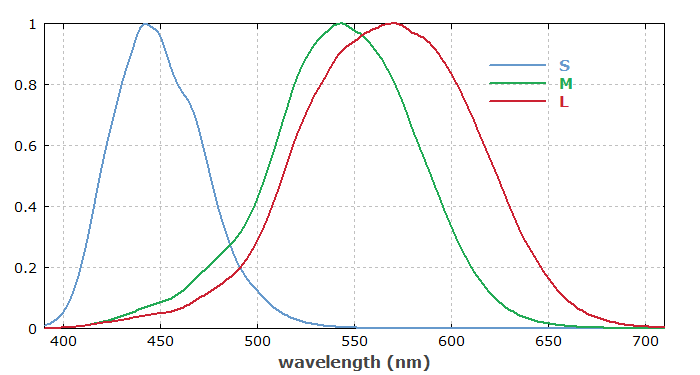
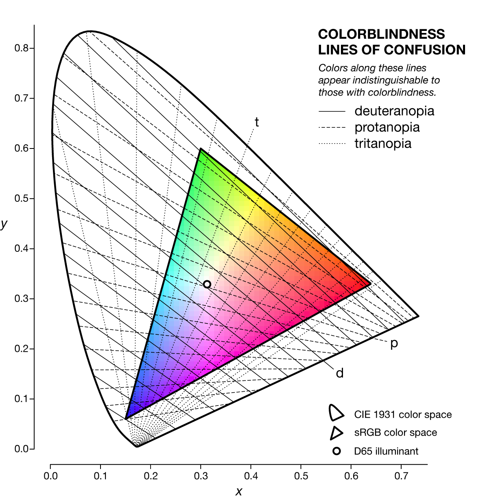
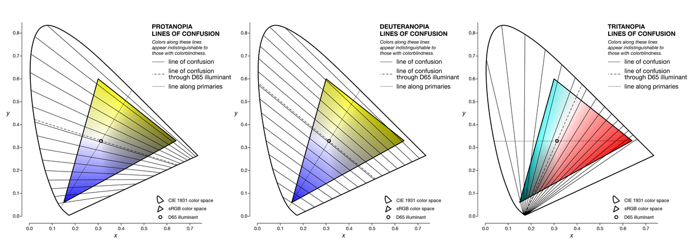
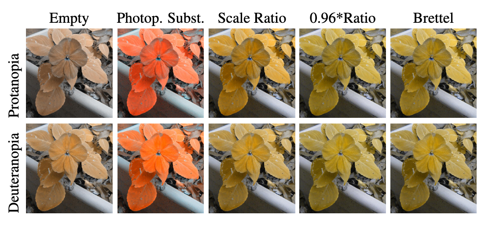

# Color Vision Deficiency

## CVD in detail

Color vision deficiency (CVD) affects about 8% of the male and 1% of the female population, with non-binary excluded (no data). [^1] CVD is caused by a malfunction of the photopigment within either of the three respective cones present within the human eye. This malfunction is a hereditary mutation within the human X chromosome, hence why males are predominantly affected due to their XY chromosome pair providing no additional backup in-case of a mutation.

Red-green blindness, meaning the inability to distinguish both colors, is the most common trait observed. This is due to either the red (protan) or green (deutan) cone or both being affected. With the blue (tritan) cone affected subjects confused blue & yellow, while a joint malfunction is referred to as achromatopsia.

All traits of CVD are thought to be largely underdiagnosed or misclassified with many individuals remaining unaware of their affliction.

This project aims to bridge this gap by providing a reasonably lightweight prove-of-concept implementation on one of the most widely used and most easy accessible VR headsets out there. For more details please visit the [Implementation](implementation.md#implementation) section.

The overall distribution is listed as follows for overall prevalence of CVD [^1] [^7] [^8] [^9] [^10];

| Population / Region  | Males (%) | Females (%) |
|-------|-----|------------|
| European Caucasians | 8  | 0.4   |
| Chinese    | 4.0-6.9  | <1   |
| Japanese  | ~4.0  | <1 |
| Druze Arabs  | 10  | NA |
| Aboriginal Australians  | 1.9  | NA |
| Fijians  | 0.8  | NA |
| DR Congolese  | 1.7  | NA |
| Indians (Andhra Pradesh)  | 7.5  | NA |
| Norwegians  | 9  | NA |
| Russians  | 9.2  | NA |
| Norther Europe / USA  | 8.0  | 0.5 |
| Nigeria (Imo State)  | 4.7  | 1.1 |
| India (Hyderabad)  | 1.33  | 0.25 |
| Republic of Ireland  | 4.7  | NA |
| South Africa (Durban)  | 2.2  | NA |

While the actual distribution of the individual types is a little less clear  [^1] [^13];

| Type | Affected Cones  | Prevalence |
|-------|-----|------------|
| Protanopia | L (red) absent | ~1^% males |
| Deuteranopia | M (green) absent | ~6^% males |
| Tritanopia | S (blue) absent | ~0.67^% males |
| Achromatopsia | all three absent | NA |
| Anomalous trichromacy | any impacted | males 1.17% |
| Dichromacy | two present | males 1.59% |
| Monochromacy | one present | males 0.36% |

Currently represented in this table are the highest values found in both studies, however their individual estimates differ quite a bit. This just proves the need for better diagnostic work and population tracking for CVD.

## Concepts

### Basics

Human normal color vision (also called normal trichromacy) requires three kinds of retinal photoreceptors with peak sensitivity in the large, medium and short wavelength portions of the visible spectrum. [^1] [^2] [^3] They are referred to as L, M and S cones each containing photopigments which respond to a specific spectral response being invoked. The sensitivity of these pigments however, can be shifted to a different band in the spectrum due to natural variations in the proteins which comprise any given photopigment.

Whenever such a shift occurs, the human ability to perceive colors within the visible spectrum is impacted causing any of the aforementioned conditions referred to as an anomalous trichromacy. Should a photopigment cease function or be absent altogether the condition is referred to as an *opia*, i.e protanopia, deuteranopia or tritanopia.

Tritanopia, -anomaly stems from the S cone being impacted, with deuteran- & protanopia, -anomaly involve the M and L cones respectively.

### Color space

There exist multiple different mathematical representations of how colors can be reconstructed and described by matching different information channels. The LMS color space for instance represents the three channels L, M, S and assigns colors by the strength of excitation measured from each channel at a given input. Due to the way the different spectra overlap it is not possible to have non-zero M with L & S being zero. Is is also not apparent how to generate a specific impulse to address a particular point in LMS due to this overlap. [^2] [^3] [^12]

Another popular color space within the breadth of RGB color spaces, which addresses this limitation, is sRGB.  sRGB represents colors as additive values per red, green & blue color channel, each defining 0-255 color values per channel representing a combined 16.777.216 possible colors. This combination of channel values defines how an impulse (light) is constructed.

Transforming between different color spaces is an essential part of how color vision deficiency models work. As each color space defines coordinates to achieve a given color within each space, transformations can be defined to convert one coordinate in one color space to another coordinate in another space representing the same or an approximate color. However, the transform relies on approximate colors more often than not and is subject to rounding errors due to limited resolution depending on the color space used, i.e. sRGB with 256 values or 8 bits of information.

### Lines of confusion

As the name implies a line of confusion in the context of perceivable color is the confusion of colors by a color vision deficient person due to their inability to correctly perceive a given spectrum in the markup of that color. [^4] These colors along a given line appear identical.

The following is a representation of these lines per condition:

For more information please visit [Designing for Color blindness](https://mk.bcgsc.ca/colorblind/math.mhtml#projecthome).

## Models

### Coblis v1

For Coblis v1 the information on how the model has been developed or functions effectively does not exist. As mentioned in [About the models](index.md#about-the-models) the model was created due to simple experimentation and related information has been taken down due to the models uncontrolled spread through the internet. Even today most of the available CVD simulation apps for mobile devices implement the faulty matrices. As such the model was also implemented in this simulation to document its heritage and provide acceptable context.

While Coblis v2 has not been implemented, it does claim to be more accurate by implementing approaches from Brettel et al. [^5] and Machado et al. [^2].

### Machado

For anomalous trichromacy Machado et al. [^2] models the shift in the spectral sensitivity function of each cone according to the degree of severity of the anomaly. A shift of 20 nm in the LMS color space represents a severe anomaly for protanomaly & deuteranomaly, with both L and M effectively overlapping.

Simulation is achieved via a two-step approach, first the aforementioned shift with a conversion to the opponent-color space defined by Inglin and Tsou et al. [^6] and finally to RGB and back.

The second step is considering Dichromacy with Machado et al. [^2] adopting the model of cone replacement. For the replacement theory the "lost" photopigment of one of the cones is substituted by another pigment instead of simply having an entirely empty or even missing cone.  However the replacement model seems less likely for tritanopia as the position within the X chromosome and amount of exons differs as opposed to protanopia and deuteranopia being effectively very close in position within the X chromosome and amount of exon. As such the Machado model is not intended to handle tritanopia.

In short the model simulates three cones with two types of photopigment present for dichromacy. Since L and M-cones are sufficiently similar their respective spectral sensitivity functions can be substituted.

However as can be seen in the figure above, even the replacement model is clearly incorrect, which results from the area under the curve being sufficiently different even with their peak sensitivity being independently normalized. To solve for this inaccuracy the respectively swapped L or M-cone spectral sensitivity curve needs to be rescaled to match the shape of the replaced curve. However, even then the simulation might appear a little redish. An additional reduction in the area ratio is applied by Machado et al. [^2] to account for that.

### Future models

As mentioned Brettel et al. [^5] is another approach to color vision deficiency simulation and predates Machado et al. [^2] approach. This model is a suitable candidate to be implemented in future revisions. Brettel et al. [^5] represent color stimuli as vectors in a three dimensional LMS space and express the simulation as a projection of each stimulus onto a reduced stimulus surface.

Similarly Sun et al. [^10] is a quite recent approach, as opposed to Brettel & Machado, which are 29 and 17 years old respectively. They claim to have improved upon Machado work significantly specifically for red-green simulation, meaning either protanopia or deuteranopia. Their model is based on the CIE 2006 physiological observer model and alters the waveforms of the anomalous L, M cones instead of maintaining them.

Both models have not been integrated yet, as there are no precomputed matrices yet which this proof-of-concept requires and a full implementation of each algorithm has been skipped due to time constraints.

## Further reading

To read more about lines of confusion, color conversion and alike, please visit [this excellent blog](https://mk.bcgsc.ca/colorblind/math.mhtml) by Martin Krzywinski.

He also just recently published another [excellent blog](https://mk.bcgsc.ca/ishihara-tests-for-colour-deficiency/) about the [Ishihara test](https://en.wikipedia.org/wiki/Ishihara_test).

[^1]: Almustanyir, A. A Global Perspective of Color Vision Deficiency: Awareness, Diagnosis, and Lived Experiences. Healthcare 2025, 13, 2031. https://doi.org/10.3390/healthcare13162031 

[^2]: L. A. F. Fernandes, M. M. Oliveira and G. M. Machado, "A Physiologically-based Model for Simulation of Color Vision Deficiency" in IEEE Transactions on Visualization & Computer Graphics, vol. 15, no. 06, pp. 1291-1298, November/December 2009, doi: 10.1109/TVCG.2009.113.
keywords: {Models of Color Vision;Color Perception;Simulation of Color Vision Deficiency;Anomalous Trichromacy;Dichromacy.}
URL: https://doi.ieeecomputersociety.org/10.1109/TVCG.2009.113

[^3]: https://www.rp-photonics.com/color_spaces.html

[^4]: https://mk.bcgsc.ca/colorblind/math.mhtml#projecthome

[^5]: H. Brettel, F. Viénot, and J. Mollon, "Computerized simulation of color appearance for dichromats," J. Opt. Soc. Am. A  14, 2647-2655 (1997).

[^6]: Carl R. Ingling, Brian Huong-Peng Tsou,
Orthogonal combination of the three visual channels,
Vision Research,
Volume 17, Issue 9,
1977,
Pages 1075-1082,
ISSN 0042-6989,
https://doi.org/10.1016/0042-6989(77)90013-X.

[^7]: Moudgil, T.; Arora, R.; Kaur, K. Color vision impairment in school children. In Highlights on Medicine and Medical Research; B P
International: Bhanjipur, India, 2021; pp. 9–17.

[^8]: Tan, T.; Wongsawad, W.; Hurairah, H.; Loy, M.J.; Lwin, W.W.; Rawi, N.A.M.; Sidik, M.; Grzybowski, A.; Raman, R.;
Ruamviboonsuk, P.; et al. Colour vision restrictions for driving: An evidence-based perspective on regulations in ASEAN
countries compared to other countries. Lancet Reg. Health Southeast Asia 2023, 14, 100171

[^9]: Tang, T.; Alvaro, L.; Alvarez, J.; Maule, J.; Skelton, A.; Franklin, A.; Bosten, J. Colourspot, a novel gamified tablet-based test for
accurate diagnosis of color vision deficiency in young children. Behav. Res. Methods 2022, 54, 1148–1160. 

[^10]: Birch, J. Worldwide prevalence of red-green color deficiency. J. Opt. Soc. Am. A Opt. Image Sci. Vis. 2012, 29, 313–320.

[^11]: L. Sun, S. Ma, Y. Tao, et al., “ A Physiologically-Based Simulation Model of Color Appearance for Red-Green Color Vision Deficiency,” Color Research & Application 50, no. 6 (2025): 565–576, https://doi.org/10.1002/col.22992. 

[^12]: Xiaojie Zhao, Boyang Fu, Zhenxing Li, Chengya Lu, Qi Dai,
Evaluating the accuracy of color vision deficiency simulation: Methodologies and a comparative analysis of current models,
Optics Communications,
Volume 587,
2025,
131961,
ISSN 0030-4018,
https://doi.org/10.1016/j.optcom.2025.131961.
(https://www.sciencedirect.com/science/article/pii/S0030401825004894)

[^13]: Yi Deun Jeong, Jaehyeong Cho, Yejun Son, Yeona Jo, Yesol Yim, Tae Hyeon Kim, Soeun Kim, Hanseul Cho, Masoud Rahmati, Lee Smith, Ho Geol Woo, Ja Hye Kim, Yoon Jeon Kim, Jee Myung Yang, Dong Keon Yon,
Global Prevalence of Congenital Color Vision Deficiency among Children and Adolescents, 1932–2022,
Ophthalmology,
Volume 132, Issue 12,
2025,
Pages 1431-1444,
ISSN 0161-6420,
https://doi.org/10.1016/j.ophtha.2025.07.031.
(https://www.sciencedirect.com/science/article/pii/S0161642025004658)