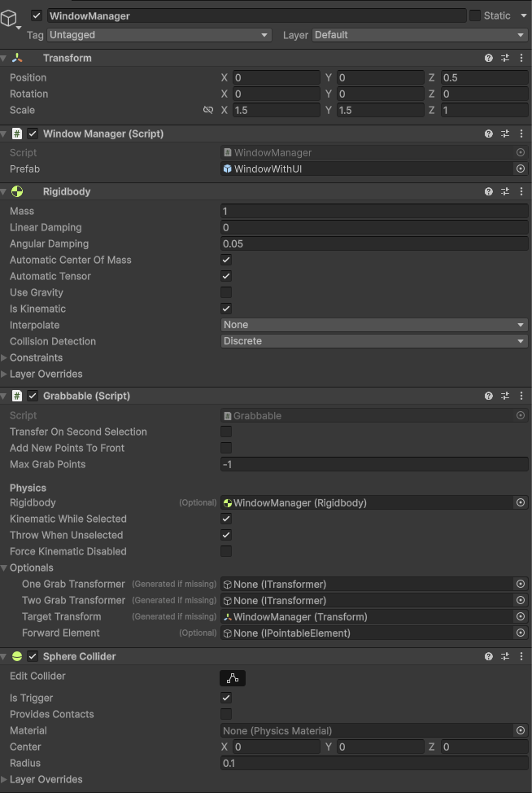
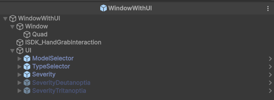
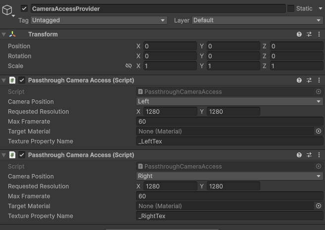
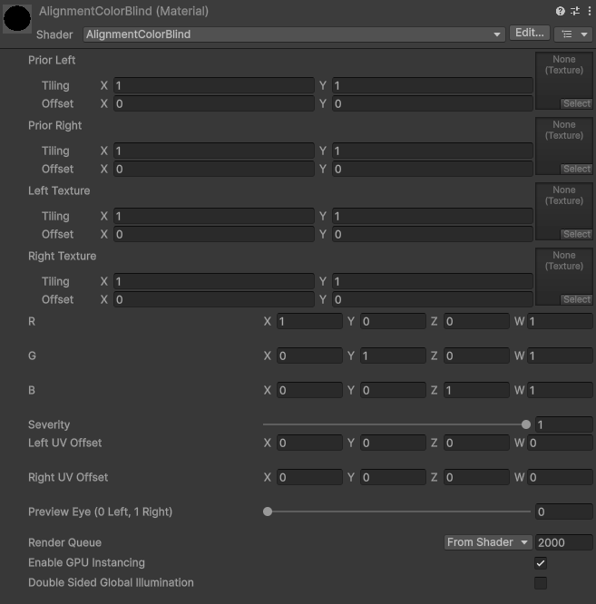

# Implementation

## Impairment scene

When opening the scene you will see a single UI element.

This UI element is the `WindowManager`.

### WindowManager

This `GameObject` is responsible for spawning any windows that will be added to the scene. These windows will the simulate the color vision deficiency affect. There can be an infinit number of windows spawned. At some point this might affect performance, but no issue were observed with up to 50 windows added at a given time.

Windows can be deleted with the `Destroy Window` button. Currently they will be destroyed in the exact order they have been spawned in.

### Window

A window is encapsulated within a `WindowsWithUI` prefab found within the `Impairment/Prefabs` folder.

This prefabs holds both the window that displays the passthrough and the UI shown below each window, to select different modes, adjust the severity of the condition and swap between the supported [models](index.md#available-models).

A window is build from a [Passthrough Camera Visualizer Building Block](https://developers.meta.com/horizon/documentation/unity/unity-passthrough-tutorial-with-blocks/) provided by Meta. This `BuildingBlock` receives an additional `StereoCameraMappingController` script which assign a [PassthroughCameraAccess Building Block](https://developers.meta.com/horizon/documentation/unity/unity-passthrough-tutorial-with-blocks/) for each eye. The script can be found in `Impairment/Scripts`.

Currently the supported color conversion matrices are hardcoded within the `StereoCameraMappingController`. The controller grabs the `PassthroughCameraAccess` once it is available and maps it to each eye. Each frame it checks and updates related parameters in the [AlignmentColorBlind](#alignmentcolorblind-shader) shader to align the passthrough with a users viewport and "correct" all displayed colors to simulate a CVD experience.

The `PassthroughCameraAccess` is provided by a [CameraAccessProvider](#cameraaccessprovider) within the scene. This is a vital component, please check if it exists within a scene as otherwise the spawned windows will remain black.

### CameraAccessProvider

Is made up of two `PassthroughCameraAccess` script, one for each eye at a given resolution and framerate. There can only be one provider and at most one `PassthroughCameraAcess` script active for each eye. Otherwise the project will error out.

### AlignmentColorBlind shader

The shader is the last major component of the project. It takes parameters necessary for aligning the passthrough to world view as well as the color conversion matrix to be applied to the passthrough. It then align the view and samples each `PassthroughCameraAccess` each frame to apply the conversion. This is done per eye so the right eye receives the right camera access and vice versa.

Color conversion is done by apply each of the perceptual shifts defined within the conversion matrices for either the Red, Green & Blue RGB color channels to the RGB color channels sampled by the shader, i.e. matrix multiplication.
