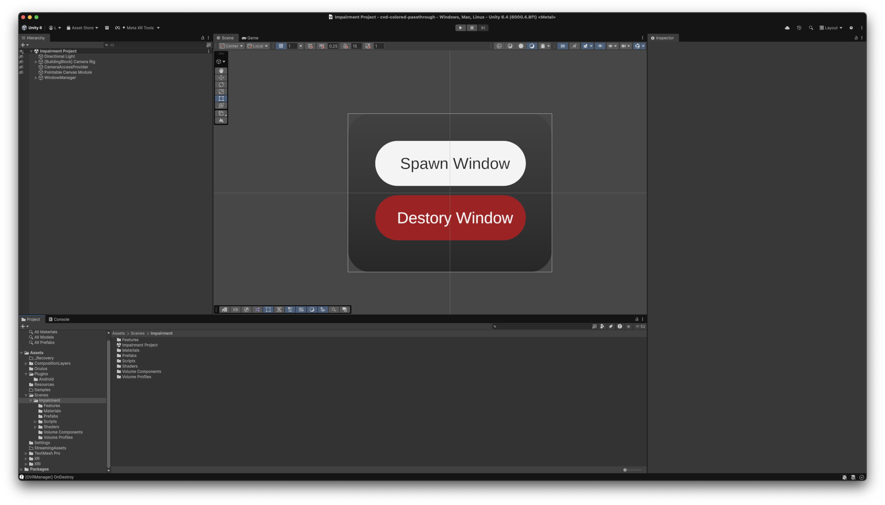
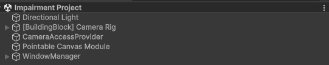

# Quickstart-Guide

## Installation

Simply clone this repository

```bash
git clone https://github.com/leuchthelp/cvd-colored-passthrough.git
```

and add it through [Unity-Hub](https://docs.unity.com/en-us/hub/install-hub) as one of your project.

Once added; download a compatible version of Unity (>=v6.4) and open the project in Unity.



In the editor navigate to `Assets -> Scenes -> Impairment` and open the `Impairment` scene.

Inside you will find all necessary components to run the project on [Meta Quest headsets](https://www.meta.com/de/en/quest/). 

If you do not have access to a [Meta Quest headsets](https://www.meta.com/de/en/quest/) you can also run the project within the [MetaXRSimulator](https://developers.meta.com/horizon/documentation/unity/xrsim-getting-started/) available for macOS & Windows. Since v201 the [CameraPassthroughAPI](https://developers.meta.com/horizon/documentation/unity/unity-passthrough-tutorial/) is fully supported by the simulator allowing you to experience the impairments without a VR headset.

## Inside the scene



Within the scene you will find everything needed to run the project. Please ensure the `CameraAccessProvider` and the `WindowManager` are present.

For more detail about the individual components visit the [Implementation](implementation.md#implementation) section.
